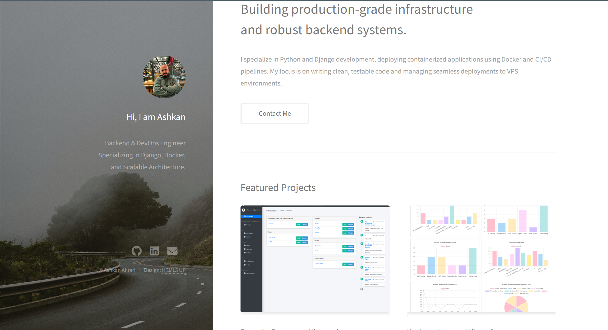

# Ashkan Ahrari | Portfolio Website

> **Live Demo:** [codewithashkan.com](https://codewithashkan.com)

A production-grade, containerized portfolio website built to showcase my backend engineering and DevOps projects. Unlike standard static portfolios, this is a full-stack Django application running inside Docker, served via Nginx, and deployed automatically using GitHub Actions.

<p align="center">

</p>

## Tech Stack

I built this project to demonstrate a robust, scalable backend architecture.

**Backend & Database**
*  **Python 3.11**
*  **Django Framework**
*  **PostgreSQL**

**Infrastructure & DevOps**
*  **Docker & Docker Compose**
*  **Nginx**
*  **Gunicorn**
*  **CI/CD Pipeline**

**Frontend**
* **HTML5 UP (Strata)** customized template.
* **Dynamic Rendering:** Content is fetched from the database, not hardcoded HTML.

---

## Key Features

* **Dockerized Environment:** The entire app (Web, DB, Nginx) runs in isolated containers.
* **Dynamic Project Management:** Projects, descriptions, and tech stacks are managed via the Django Admin panel.
* **Automated Deployment:** Pushing to the `main` branch triggers a GitHub Action that SSHs into the VPS, pulls the latest code, and rebuilds the containers with zero manual intervention.
* **Production Ready:** Uses Gunicorn as the application server and Nginx as the reverse proxy for security and performance.

---

## Local Development

Want to run this locally? Since it's Dockerized, you don't need to install Python or Postgres on your machine.

1. Clone the repo
```bash
git clone [https://github.com/AsHkAn-Django/portfolio.git](https://github.com/AsHkAn-Django/portfolio.git)
cd portfolio
2. Create a .env file
Create a .env file in the root directory:
```

2. Create a .env file
Create a .env file in the root directory:

```ini
DEBUG=1
SECRET_KEY=your-secret-key-here
DB_NAME=portfolio
DB_USER=postgres
DB_PASSWORD=postgres
DB_HOST=db
ALLOWED_HOSTS=localhost,127.0.0.1
```

3. Run with Docker
```Bash
docker compose up --build
```
The site will be available at http://localhost:8002 (or whichever port is defined in your compose file).

## Deployment Pipeline
This project uses a Continuous Deployment (CD) pipeline:

1. Code Push: Code is pushed to main.

2. GitHub Action Trigger: The workflow logs into the VPS via SSH.

3. Update: It pulls the latest Git changes.

4. Rebuild: It runs docker compose up -d --build to update the containers.

5. Clean Up: Prunes old images to save disk space.

---

## Contact

- Email: [Ashakn.ahrari@gmail.com](mailto:Ashakn.ahrari@gmail.com)
- LinkedIn: [linkedin.com/in/ashkan-ahrari](https://www.linkedin.com/in/ashkan-ahrari/)
- Website: [codewithashkan.com](https://codewithashkan.com/)
- Upwork: [Hire me on Upwork](https://www.upwork.com/freelancers/~01da7811288ac228da)
---

⭐️ *Thanks for visiting my portfolio repo!*
